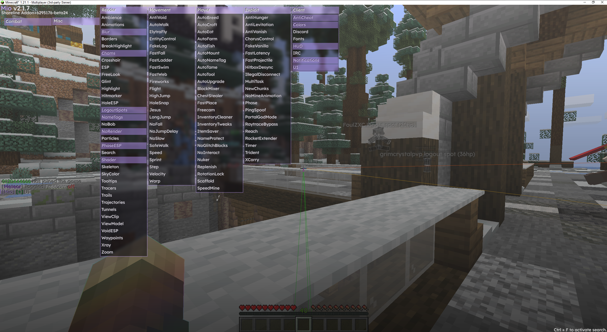
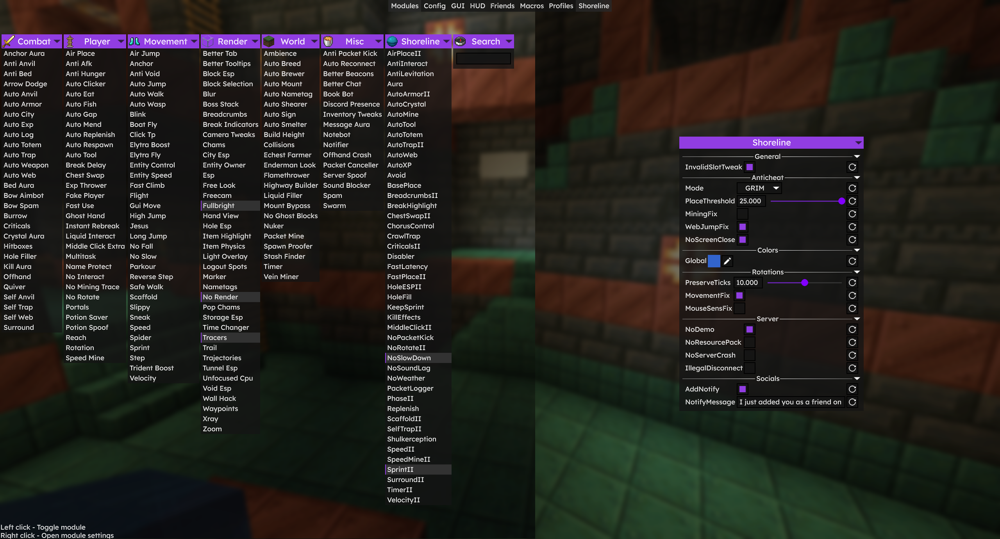

# notice: ts is now AI slop, so i will make the minimum effort to solve future issues from now on--

  

this is the shoreline clinet (1.0 beta-24-70f3cae) but umm pasted into a meteor addon!!1

- it surely works the same as original client (i hope) as it just contains part of their combat and utility modules
- has NO new features compared to the leak
- blockplacers actually fixed and -can actually replace blocks (unless yo enemy has averagely -12% your latency)- compared to another pastes
- works at grimcc, 2b2t-practice and even some features at donutSMP but it might be outdated for 2b2t (as march of 2026)
- actually at 26.2, does not require fabric api or baritone
- wont work (crash at launch) with cracked clients, but theres an option at the "Shoreline" meteor tab called "InvalidSlotTweak" that can fix slot-switching from other clients (double mining issues too)

## pics

  
  

